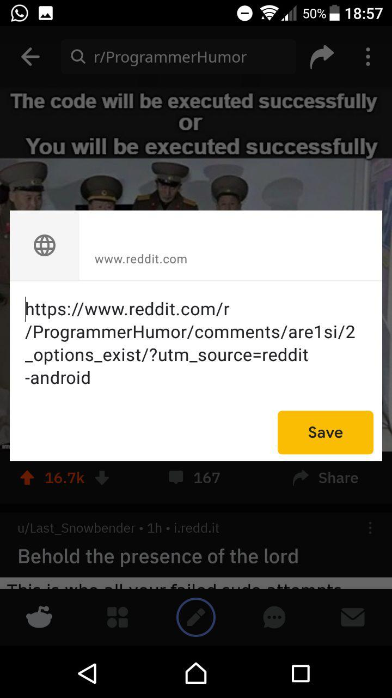

# Share Reddit

Share the meme image instead of just the link:

1. Share the link to shreddit
2. Shreddit downloads the image and prompts you where you want to share it to

## Beware

This app was created on a single evening, with Gin involved. It is not beautiful, it is the ugliest code I have written in the last few years, and it is likely that it does not work always. 

I wrote it for myself, I share it with you, but don't you expect any quality at all!

## Reason of Existence

If you want to share an image from reddit to a different app, like Telegram, Whatsapp, or for the purpose of this explanation, google notes, reddit will share the url of the page:

 

If you want to share a meme with friends, reddit requires you to instead download the image, then share it. Shreddit does that for you, without adding the image to your gallery:

## Antifeatures
* Parsing HTML with RegEx ✓ 
* Spawning several threads for no real reason ✓ 
* Avoiding function names that say what they actually do ✓ 
* Maintainability × 
* Performance = O(human) ✓ 

## Contributing

Feel free to contribute, I'm happy to review your PR!
By Contributing, you place all your work under MIT.